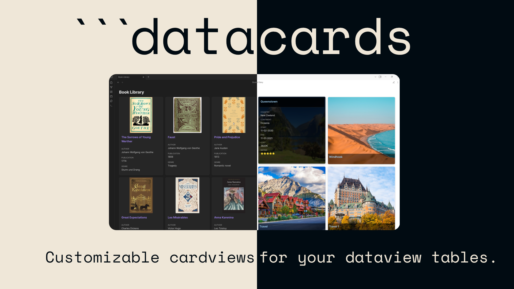

# DataCards for Obsidian



Transform Dataview query results into visually appealing, customizable card layouts.

[](https://sophokles187.github.io/data-cards/)

## Quick Start

1. **Enable**: Activate the plugin in Obsidian's Community Plugins settings
2. **Use**: Create a code block with the `datacards` language and write a Dataview query:

````markdown
```datacards
TABLE author, rating, cover FROM #books
SORT rating DESC

// Settings
preset: portrait
imageProperty: cover
```
````

That's it! Your Dataview results will now display as beautiful cards.

## Features

- **Custom Code Block**: Use `datacards` code blocks with Dataview query syntax
- **Flexible Presets**: Multiple card preset options (grid, portrait, square, compact, dense) optimized for different use cases
- **Highly Customizable**: Adjust nearly all settings per code block, mixing and matching preset characteristics, including property display and font size options
- **Advanced Image Support**: Display images from frontmatter properties with support for wiki links, embedded wiki links (`![[image.jpg]]`), and markdown syntax
- **Dynamic & Fixed Columns**: Choose between responsive dynamic columns or fixed column layouts with unlimited column support
- **Smart Settings Hierarchy**: Per-block settings properly override global settings with clear priority rules
- **Global Settings**: Default configuration with per-block overrides
- **Mobile Optimization**: Dedicated mobile settings for better display on small screens
- **Performance Enhancements**: Lazy loading for images to improve loading times

## Documentation

Visit the [documentation site](https://sophokles187.github.io/data-cards/) for complete guides, examples, and reference materials:

## Requirements

- [Obsidian](https://obsidian.md/) v0.15.0+
- [Dataview Plugin](https://github.com/blacksmithgu/obsidian-dataview)

## Installation

### Community Plugins
> **Note**: DataCards is not yet available in the Community Plugins store. Please use BRAT or manual installation until then.

1. Open Obsidian Settings
2. Go to Community Plugins
3. Click "Browse" and search for "Data Cards"
4. Click "Install", then "Enable"

## Example Usage

Create a `datacards` code block with a Dataview query and optional settings:

````markdown
```datacards
TABLE author, rating, genre, cover FROM #books
SORT rating DESC
WHERE rating >= 4

// Settings
preset: portrait
columns: 8
imageProperty: cover
properties: [author, rating, genre]
```
````

> **Important**: You must explicitly include all properties you want to display in your Dataview query (including the image property).

See the [documentation](https://sophokles187.github.io/data-cards/#/examples/books)ok for more detailed examples.

## Support Development

If you find DataCards useful and would like to support its development, consider buying me a coffee:

[](https://ko-fi.com/sophokles)

## License

GNU General Public License v3.0 (GPL-3.0)

This project is licensed under the GNU General Public License v3.0 - see the [LICENSE](LICENSE) file for details.

## Acknowledgments

- [Dataview Plugin](https://github.com/blacksmithgu/obsidian-dataview) (MIT License) - This plugin uses the Dataview API
