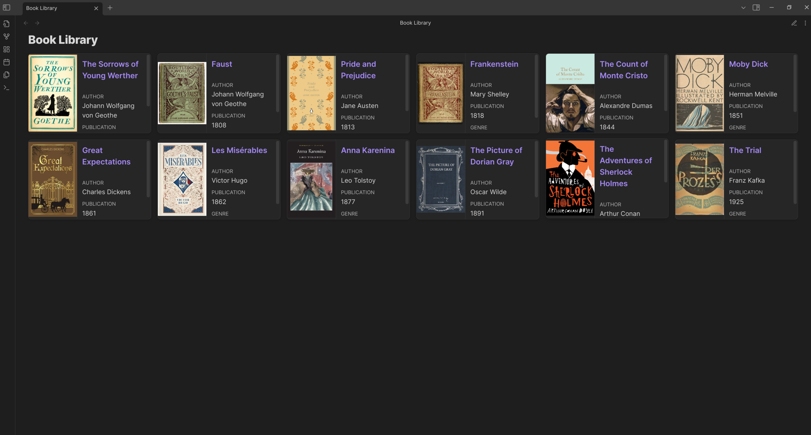

# Photo Gallery Example

This example shows how to create a photo gallery with DataCards.

## Basic Photo Gallery

A simple gallery display for your photos:

```markdown
```datacards
TABLE file.link as "Photo", location, date, image FROM #photos
SORT date DESC

// Settings
preset: square
imageProperty: image
columns: 4
```
```



## Properties to Include in Your Photo Notes

For this example to work, make sure your photo notes have:

```yaml
---
tags: photos
location: "Paris, France"
date: 2023-06-15
image: "attachments/paris-photo.jpg"
---
```

## Advanced Photo Gallery

More detailed version with additional properties:

```markdown
```datacards
TABLE 
  file.link as "Title", 
  location, 
  date,
  camera,
  "" as Photo
FROM #photos
SORT date DESC

// Settings
preset: square
imageProperty: image
columns: 4
defaultDateFormat: YYYY-MM-DD
```
```

## Filter by Location

Display photos from a specific location:

```markdown
```datacards
TABLE file.link as "Photo", date, image FROM #photos
WHERE contains(location, "Italy")
SORT date DESC

// Settings
preset: square
imageProperty: image
columns: 4
```
```

## Recent Photos

Display your most recent photos:

```markdown
```datacards
TABLE file.link as "Photo", location, date, image FROM #photos
SORT date DESC
LIMIT 12

// Settings
preset: square
imageProperty: image
columns: 3
```
```

## Photo Albums

If you use sub-tags for organizing photos:

```markdown
```datacards
TABLE file.link as "Photo", location, date, image FROM #photos/vacation
SORT date DESC

// Settings
preset: square
imageProperty: image
columns: 4
```
```

## Compact Photo List

A more detailed display with photo information:

```markdown
```datacards
TABLE file.link as "Photo", location, date, camera, settings, image FROM #photos
SORT date DESC

// Settings
preset: compact
imageProperty: image
```
```

## Photo Map Integration

Combine a map with your photo gallery (requires DataviewJS and a map plugin):

```javascript
```dataviewjs
// Get all photos
const photos = dv.pages("#photos")
    .sort(p => p.date, 'desc');

// Display a map of photo locations (example - implementation depends on your map plugin)
const mapPlugin = app.plugins.plugins['obsidian-leaflet-plugin'];
if (mapPlugin) {
    // Create a map with markers for each photo location
    // This is a simplified example - actual implementation will vary
    dv.paragraph("### Photo Locations\n");
    dv.paragraph(`\`\`\`leaflet
    id: photo-locations
    height: 300px
    ${photos.filter(p => p.coordinates).map(p => 
        `marker: ${p.coordinates.lat}, ${p.coordinates.lng}, ${p.file.link}`
    ).join('\n')}
    \`\`\``);
}

// Generate a DataCards block for the photos
dv.paragraph("### Photo Gallery\n");
dv.paragraph(`\`\`\`datacards
TABLE file.link as "Photo", location, date, image FROM #photos
SORT date DESC
LIMIT 12

// Settings
preset: square
imageProperty: image
columns: 4
\`\`\``);
```
```

## Photo Statistics

Display statistics about your photo collection:

```javascript
```dataviewjs
// Get all photos
const photos = dv.pages("#photos");

// Group by location
const locations = {};
photos.forEach(photo => {
    if (photo.location) {
        locations[photo.location] = (locations[photo.location] || 0) + 1;
    }
});

// Group by year
const years = {};
photos.forEach(photo => {
    if (photo.date) {
        const year = new Date(photo.date).getFullYear();
        years[year] = (years[year] || 0) + 1;
    }
});

// Output stats
dv.paragraph(`📸 **Total Photos**: ${photos.length}`);
dv.paragraph(`🌍 **Top Locations**:`);
Object.entries(locations)
    .sort((a, b) => b[1] - a[1])
    .slice(0, 5)
    .forEach(([location, count]) => {
        dv.paragraph(`- ${location}: ${count} photos`);
    });

dv.paragraph(`📅 **Photos by Year**:`);
Object.entries(years)
    .sort((a, b) => b[0] - a[0])
    .forEach(([year, count]) => {
        dv.paragraph(`- ${year}: ${count} photos`);
    });
```