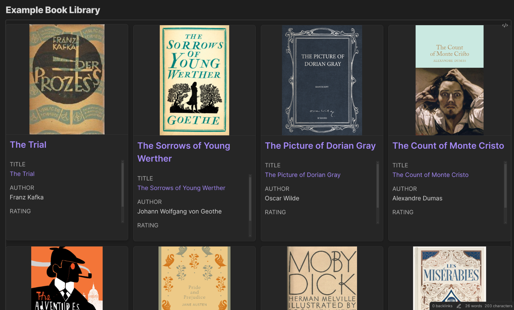

# Book Library Example

This example shows how to create a book library display with DataCards.

## Table of contents

- [Basic Book Display](#basic-book-display)
- [Properties to Include in Your Book Notes](#properties-to-include-in-your-book-notes)
- [Advanced Book Library](#advanced-book-library)
- [Filter by Genre](#filter-by-genre)
- [Currently Reading Shelf](#currently-reading-shelf)
- [Tag-Based Organization](#tag-based-organization)
- [Compact Book List](#compact-book-list)
- [Integration with DataviewJS (Advanced)](#integration-with-dataviewjs-advanced)

## Basic Book Display

A simple card display for your book collection:

```dataview
TABLE file.link as "Title", author, rating, genre, cover FROM #books
SORT rating DESC

// Settings
preset: portrait
imageProperty: cover
```



## Properties to Include in Your Book Notes

For this example to work, make sure your book notes have:

```yaml
---
tags: books
author: Author Name
rating: 4.5
genre: Fiction
cover: https://example.com/book-cover.jpg
---
```

## Advanced Book Library

More detailed version with additional properties:

```dataview
TABLE 
  file.link as "Title", 
  author, 
  rating, 
  genre, 
  "" as cover,
  status,
  dateRead 
FROM #books
SORT rating DESC

// Settings
preset: portrait
imageProperty: cover
defaultDateFormat: YYYY-MM-DD
properties: [file.link, author, rating, genre, status, dateRead]
```

## Filter by Genre

Display only books from a specific genre:

```dataview
TABLE file.link as "Title", author, rating, genre, cover FROM #books
WHERE contains(genre, "Fantasy")
SORT rating DESC

// Settings
preset: portrait
imageProperty: cover
```

## Currently Reading Shelf

Display books you're currently reading:

```dataview
TABLE file.link as "Title", author, rating, genre, cover, progress FROM #books
WHERE status = "Reading"
SORT file.ctime DESC

// Settings
preset: portrait
imageProperty: cover
columns: 2
```

## Tag-Based Organization

If you use sub-tags for organizing books:

```dataview
TABLE file.link as "Title", author, rating, cover FROM #books/fiction
SORT rating DESC

// Settings
preset: portrait
imageProperty: cover
```

## Compact Book List

A more compact display for many books:

```dataview
TABLE file.link as "Title", author, genre, rating, cover FROM #books
SORT file.ctime DESC

// Settings
preset: compact
imageProperty: cover
```

