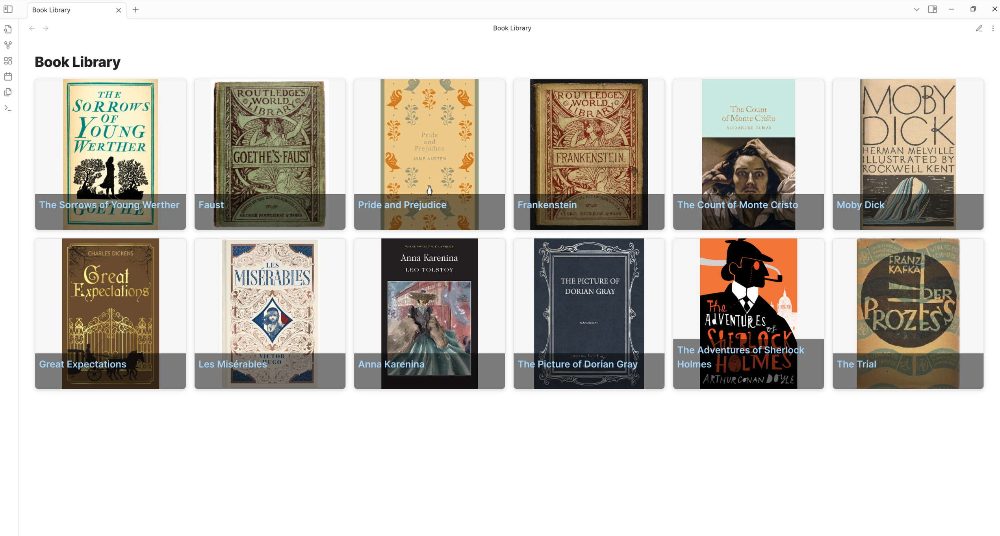

# Movie Collection Example

This example shows how to create a movie collection display with DataCards.

## Basic Movie Collection

A simple card display for your movie collection:

```dataview
TABLE file.link as "Title", director, year, rating, poster as "Poster" FROM #movies
SORT rating DESC

// Settings
preset: portrait
imageProperty: poster
```



## Properties to Include in Your Movie Notes

For this example to work, make sure your movie notes have:

```yaml
---
tags: movies
director: Director Name
year: 2022
rating: 4.5
genre: [Action, Sci-Fi]
poster: https://example.com/movie-poster.jpg
watched: 2022-03-15
---
```

## Full Movie Database

More detailed version with additional properties:

```dataview
TABLE
  file.link as "Title",
  director,
  year,
  rating,
  genre,
  watched,
  runtime,
  poster
FROM #movies
SORT rating DESC

// Settings
preset: portrait
imageProperty: poster
defaultDateFormat: YYYY-MM-DD
properties: [file.link, director, year, rating, genre, watched, runtime]
```

## Filter by Genre

Display only movies from a specific genre:

```dataview
TABLE file.link as "Title", director, year, rating, poster FROM #movies
WHERE contains(genre, "Sci-Fi")
SORT rating DESC

// Settings
preset: portrait
imageProperty: poster
```

## Recently Watched Movies

Display your recently watched movies:

```dataview
TABLE file.link as "Title", director, year, rating, poster, watched FROM #movies
WHERE watched
SORT watched DESC
LIMIT 10

// Settings
preset: portrait
imageProperty: poster
```

## Compact Movie List

A more compact display for many movies:

```dataview
TABLE
  file.link as "Title",
  director,
  year,
  rating,
  genre,
  watched,
  poster
FROM #movies
SORT year DESC

// Settings
preset: compact
imageProperty: poster
showImageOnHover: true
```

