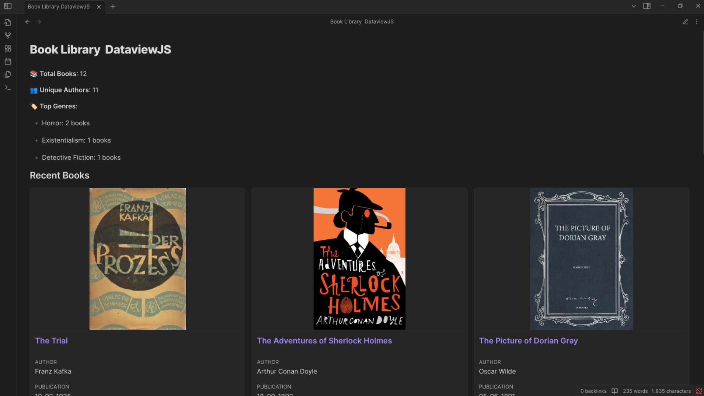

# Task Management Example

This example shows how to create a task management dashboard with DataCards.

## Basic Task Board

A simple kanban-style board for your tasks:

```markdown
```datacards
TABLE file.link as "Task", status, priority, dueDate FROM #tasks
SORT dueDate ASC

// Settings
preset: grid
conditionalFormatting: {
  "status": [
    { "condition": "= 'Completed'", "color": "#4CAF50" },
    { "condition": "= 'In Progress'", "color": "#FFC107" },
    { "condition": "= 'Not Started'", "color": "#F44336" }
  ]
}
```
```



## Properties to Include in Your Task Notes

For this example to work, make sure your task notes have:

```yaml
---
tags: tasks
status: In Progress
priority: High
dueDate: 2023-07-15
assignee: John Doe
---
```

## Advanced Task Board

More detailed version with additional properties:

```markdown
```datacards
TABLE 
  file.link as "Task", 
  status, 
  priority,
  dueDate,
  assignee,
  progress
FROM #tasks
SORT priority DESC, dueDate ASC

// Settings
preset: grid
dynamicUpdate: true
conditionalFormatting: {
  "priority": [
    { "condition": "= 'High'", "color": "#F44336" },
    { "condition": "= 'Medium'", "color": "#FFC107" },
    { "condition": "= 'Low'", "color": "#4CAF50" }
  ],
  "status": [
    { "condition": "= 'Completed'", "color": "#4CAF50" },
    { "condition": "= 'In Progress'", "color": "#2196F3" },
    { "condition": "= 'Not Started'", "color": "#9E9E9E" }
  ]
}
```
```

## Filter by Status

Display tasks with a specific status:

```markdown
```datacards
TABLE file.link as "Task", priority, dueDate, assignee FROM #tasks
WHERE status = "In Progress"
SORT dueDate ASC

// Settings
preset: grid
```
```

## Due Today

Display tasks due today:

```markdown
```datacards
TABLE file.link as "Task", status, priority, assignee FROM #tasks
WHERE date(dueDate) = date(today)
SORT priority DESC

// Settings
preset: grid
columns: 2
```
```

## Project-Specific Tasks

If you use sub-tags for organizing tasks:

```markdown
```datacards
TABLE file.link as "Task", status, priority, dueDate FROM #tasks/project-alpha
SORT dueDate ASC

// Settings
preset: grid
```
```

## Compact Task List

A more compact display for many tasks:

```markdown
```datacards
TABLE file.link as "Task", status, priority, dueDate, assignee FROM #tasks
SORT dueDate ASC

// Settings
preset: compact
```
```

## Task Dashboard with Statistics

Combine statistics with your task board:

```javascript
```dataviewjs
// Get all tasks
const tasks = dv.pages("#tasks");

// Count tasks by status
const statusCounts = {
  "Completed": 0,
  "In Progress": 0,
  "Not Started": 0
};

tasks.forEach(task => {
  if (task.status) {
    statusCounts[task.status] = (statusCounts[task.status] || 0) + 1;
  }
});

// Count tasks by priority
const priorityCounts = {
  "High": 0,
  "Medium": 0,
  "Low": 0
};

tasks.forEach(task => {
  if (task.priority) {
    priorityCounts[task.priority] = (priorityCounts[task.priority] || 0) + 1;
  }
});

// Count overdue tasks
const today = new Date();
today.setHours(0, 0, 0, 0);
const overdueTasks = tasks.filter(task => 
  task.dueDate && new Date(task.dueDate) < today && task.status !== "Completed"
).length;

// Output stats
dv.paragraph(`📋 **Total Tasks**: ${tasks.length}`);
dv.paragraph(`⏱️ **Status Breakdown**:`);
Object.entries(statusCounts).forEach(([status, count]) => {
  dv.paragraph(`- ${status}: ${count} tasks`);
});

dv.paragraph(`🚨 **Priority Breakdown**:`);
Object.entries(priorityCounts).forEach(([priority, count]) => {
  dv.paragraph(`- ${priority}: ${count} tasks`);
});

dv.paragraph(`⚠️ **Overdue Tasks**: ${overdueTasks}`);

// Generate a DataCards block for high priority tasks
dv.paragraph("### High Priority Tasks\n");
dv.paragraph(`\`\`\`datacards
TABLE file.link as "Task", status, dueDate, assignee FROM #tasks
WHERE priority = "High" AND status != "Completed"
SORT dueDate ASC

// Settings
preset: grid
conditionalFormatting: {
  "status": [
    { "condition": "= 'In Progress'", "color": "#2196F3" },
    { "condition": "= 'Not Started'", "color": "#9E9E9E" }
  ]
}
\`\`\``);
```
```

## Assignee Workload

View tasks assigned to specific team members:

```markdown
```datacards
TABLE file.link as "Task", status, priority, dueDate FROM #tasks
WHERE assignee = "John Doe"
SORT dueDate ASC

// Settings
preset: grid
```
```

## Timeline View

Organize tasks by due date:

```markdown
```datacards
TABLE file.link as "Task", status, priority, assignee FROM #tasks
WHERE status != "Completed"
SORT dueDate ASC

// Settings
preset: grid
groupBy: "dueDate"
dateFormat: {
  "dueDate": "MMMM D, YYYY"
}
```